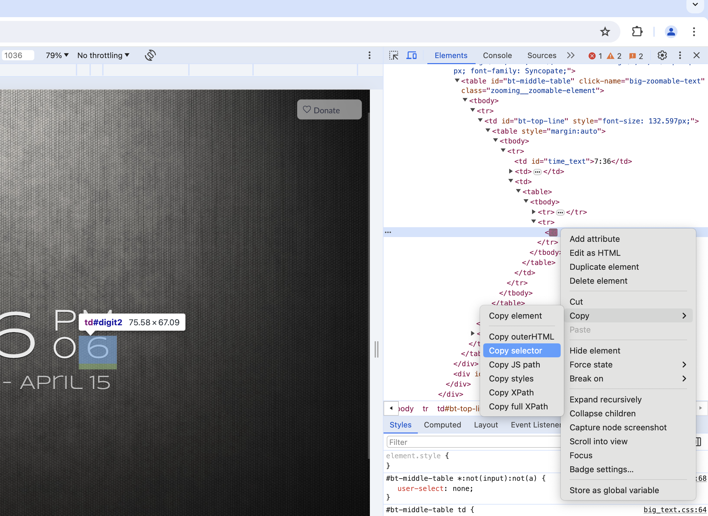

<div align="center">
  
# Webscraping With Telegram Notifications

This Node.js script will periodically check a given website and send you a telegram notification whenever a change happens !

</div>


# Project Overview

The main objectives of this project include:
- Creating a Telegram bot
- Monitoring specific elements of a website at regular intervals, checking for changes.
- Sending notifications to the user via the Telegram bot when changes are detected.

With this script running, you will be among the first notified for university courses (when the registrations open, because let's face it, you don't want to check every minute/hour during summer holidays) or when other registrations with no exact time opens.

# Getting Started

To run this project locally, follow these steps:

1. Clone this repository to your local machine.
2. Navigate to the project directory.
3. Install dependencies using `npm install`.
4. 1. Create a Telegram bot and get the api key from BotFather 
5. Put the api key for the bot in an .env file that you create and put it at the root of the repository (to help, follow the instruction in [.dummy.env](https://github.com/Thosam1/webscraping_notifier/blob/main/.dummy.env) ;D)
6. Start the  script with `npm start`.

Feel free to explore the codebase, make modifications, and customize the code to fit your needs!

# Modifications

To change the website, you just have to change the `url` variable in index.js

To change the element you watch, you can go to the dev console, and select the element, then click on copy, copy selector.

<br/>
<div align="center">



</div>
<br/>

Then you can paste the content inbetween the quotes like this 

```js
let elementWatched = $("PASTED_VALUE")
```

# Feedback

If you have ideas for new features, don't hesitate to contribute and make pull requests :)

# Last words

I wanted to host this script on vercel but didn't manage to make it work.

The other options seems to cost a certain amount money there is a concept called "worker jobs" that basically means script running in the background on the cloud, I couldn't manage to find a free solution.

This is why, the current solution only works if you have a computer that can run the script continuously, during the night too. 

Another idea would be to invest in a rasberry pi and let the script work on it 24/7.
